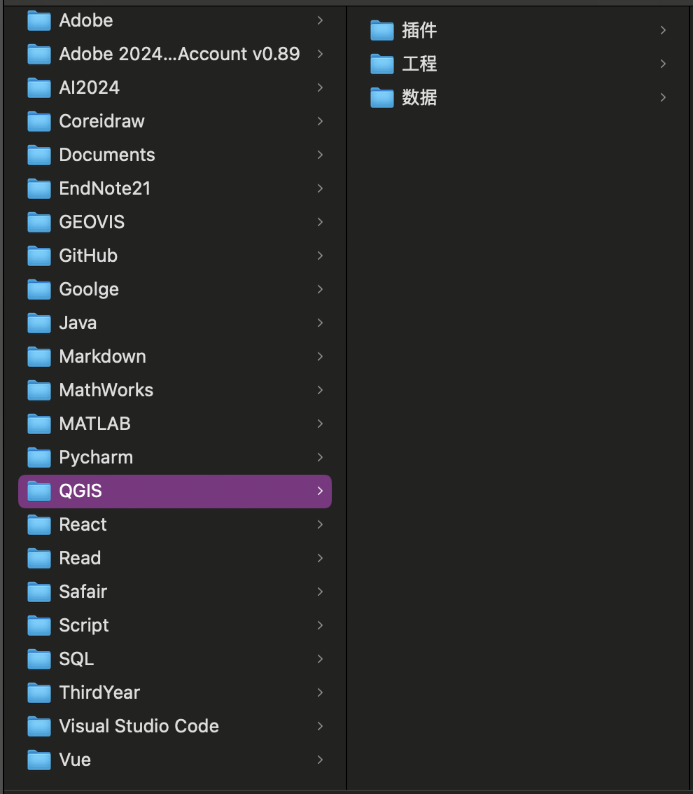
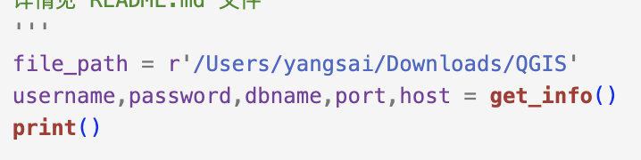

# 项目缘由

> 电脑的操作系统为Mac OS，在学习导出地理数据到数据库postgreSQL的时候，发现部分命令在macOS上无法使用，但是按照传统的流程
>
> 1. 使用QGIS一个个导入
> 2. windows带有的postgis相关软件（至少我没找到）
> 3. 不同系统间的命令行操作差异
>
> 由于我比较懒，所以就想写一个python脚本来完成这种操作，而且跨平台也可以使用。
>
> 在学习的过程中还会不断的完善代码，添加一些新的功能之类的。

main.py中的代码已经测试，能够完美将shp数据写入到对应的数据库中。

## 有关代码的解释

1. 输入连接信息：我在刚开始写的时候采用的是直接在源代码上更改信息进行数据替换，但是在某次操作的过程中发现数据只会导入到某一个数据库中，而非目标数据库，检查了一会发现是忘记改目标数据库，遂衍生出在终端输入信息的想法。
2. 文件读取：因为是自动遍历某一文件夹下的所有文件，所以在定位文件的时候并不需要特别具体的文件位置。例如：我的文件存储在"前缀/QGIS/数据"中,但是我并不知道具体有什么文件,如下图所示这时候只需要定位到"QGIS"即可:这样即可完成对文件夹的遍历:
